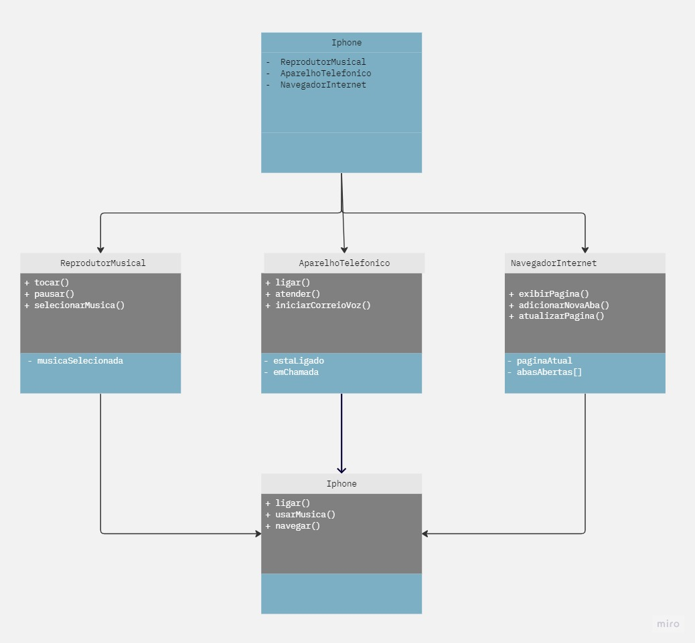

# Desafio iPhone

Este projeto representa um aplicativo para um iPhone que demonstra várias funcionalidades, incluindo um reprodutor musical, um aparelho telefônico e um navegador na Internet.

## Funcionalidades

### Reprodutor Musical
- **Tocar Música:** Inicia a reprodução de uma música.
- **Pausar Música:** Pausa a reprodução da música em andamento.
- **Selecionar Música:** Permite selecionar uma música para reprodução.

### Aparelho Telefônico
- **Ligar:** Inicia uma chamada telefônica.
- **Atender:** Permite atender chamadas telefônicas.
- **Iniciar Correio de Voz:** Inicia o correio de voz.

### Navegador na Internet
- **Exibir Página:** Permite exibir uma página da web.
- **Atualizar Página:** Atualiza a página atual.
- **Adicionar Nova Aba:** Adiciona uma nova aba de navegação.

## UML

## Como Usar

1. Clone este repositório em seu ambiente de desenvolvimento.
2. Abra o projeto em sua IDE favorita.
3. Execute a classe `Iphone` para iniciar a demonstração das funcionalidades.

## Autor

- Natanael Amaral de Barros

## Créditos

- [Lançamento iPhone 2007](https://www.dio.me)

Divirta-se explorando as funcionalidades do iPhone!

